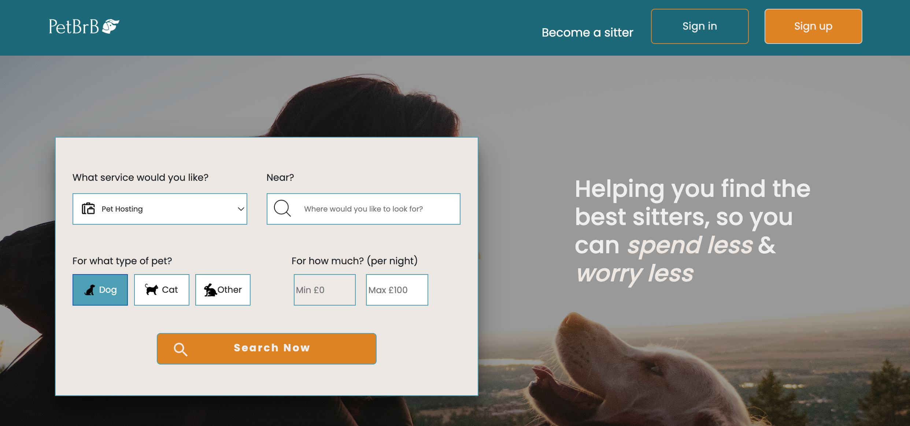
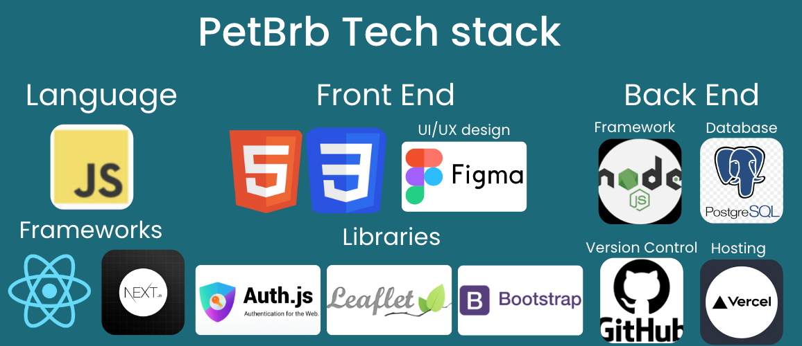
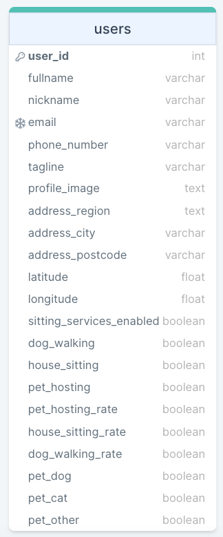

# PetBrB

A web platform for pet-sitting services.

<br/>

## Description

PetBrb provides a convenient and reliable solution for pet owners who need to find someone to care for their furry friends. The web-based application makes it simple for pet owners to locate and connect with pet sitters in their local area for services such as dog walking, pet hosting, or home sitting. Additionally, the platform presents an opportunity for people who love pets to earn additional income by becoming a pet sitter. PetBrb offers a comprehensive solution for pet owners and pet sitters and is a great way to ensure the well-being of pets.

## Demo

The website is accessible at [here](https://petbrb.vercel.app)

<br/>

## Features

- Advanced search filtering
- Data fetching through static generation and server-side rendering
- Dynamic routing for pages
- Interactive map with geolocation
- Responsive design optimized for desktop and mobile devices
- User authentication
- 'Create a profile' form with dedicated API routes for POST and PUT requests.

#### Data fetching

The `pages/index.js` file contains the client-side main page which accepts input parameters to filter the search results in the database. This page transitions to the `pages/search.js` page through `next/link` with a specific query object in the HTTP context. The `pages/search.js` page features Next.js `getServerSideProps` function, which runs only on server-side and is used to fetch data at request time. As `getServerSideProps` only runs on the server and never in the browser, the data is fetched directly from the database within this function. The data is then passed to the page component through props, which are returned from `getServerSideProps` and are rendered on the results page.

#### Dynamic routing

Dynamic routes are created to display each user's profile, which is defined in the `pages/search/[id].js` file. The `user_id` path parameter, which matches the URL, will be passed to the page as a query parameter. The `getStaticPaths` and `getStaticProps` functions in Next.js are used to fetch the data for each user based on the `user_id`. Client-side navigation to these dynamic routes is handled with `next/link`.

#### Interactive map

[Leaflet.js](https://leafletjs.com/examples/quick-start/) is utilized to display an interactive map with markers, using OpenStreetMap tiles. It sets its view using geographical coordinate. The [Postcodes.io](https://postcodes.io/) API is utilized to retrieve latitude and longitude information based on the address postcode.

#### API routes

API endpoints can be accessed at [http://localhost:3000/api/profile](http://localhost:3000/api/profie). The endpoint at this location can be modified in the `pages/api/profile.js` file.

The `pages/api` directory is mapped to `/api/*`. Files in this directory are treated as API routes.

<br/>

## Tech Stack

Javascript, React.js, Next.js v12, HTML, CSS, Auth.js, Vercel, Node.js, PostgreSQL, Leaflet, Bootstrap.

<br/>

## How To Run Locally

System requirements:

- Node.js 14.6.0 or newer
- MacOS, Windows (including WSL), and Linux are supported

Clone the project

```bash
  git clone https://link-to-project
```

Go to the project directory

```bash
  cd petup
```

Install node_modules and all required packages and dependencies

```bash
  npm install
```

Start the server

```bash
  npm run start
```

Or run this script to start the server in dev mode

```bash
  npm run dev
```

Open [http://localhost:3000](http://localhost:3000) with your browser to see the result.

## Environment Variables

To successfully run this project locally, you need to set up environment variables for database connection and authentication provider secret keys.

### Setting up cloud service for database

- Create an empty postgres database instance via a cloud-hosted database service (ex: [ElephantSQL](https://www.elephantsql.com/docs/) or [Railway](https://ekomenyong.com/insights/how-to-setup-free-postgresql-database-on-railway-app)), and copy the service connection URL.

### Setting up Authentication Providers

- Create a [Github OAuth App](https://docs.github.com/en/developers/apps/building-oauth-apps/creating-an-oauth-app) and obtain the Client ID and Client Secret keys.
- Create a [Google OAuth app](https://developers.google.com/identity/sign-in/web/sign-in) and obtain the Client ID and Client Secret keys.

### Add environment variables

Create a `.env` file in the root directory and insert the following environment variables. Be sure to list `.env` inside `.gitignore` file.

`POSTGRES_CONNECTION_URL` = [Service connection URL]
`GITHUB_ID`= [client ID of Github OAuth provider]
`GITHUB_SECRET`= [client ID of Github OAuth provider]
`GOOGLE_ID`= [client ID of Google OAuth provider]
`GOOGLE_SECRET` = [client Secret of Google OAuth provider]
`NEXTAUTH_URL` = [http://localhost:3000]

## Create and populate the database

Run this script to create the tables in the database

```bash
  npm run db-create
```

Run this script to seed the tables with sample data

```bash
  npm run db-seed
```

Run this script to reset the database (drop tables, then recreate tables and populate some sample data)

```bash
  npm run db-reset
```

### Table Diagram

The current database has been designed with a single table that merges user information and service information for ease of use. However, the database can be extended to comprise multiple tables for users, services, bookings, and reviews to enhance its structure.

<p style="text-align:center;"></p><br/>

## Authors

This product is built by Team ReFACtor of the School of Code Bootcamp cohort 13.

- Alia F. Abdul Ghaffar [@aliafarhana88](https://www.linkedin.com/in/aliafarhana88/)
- Amina Malima [@mia-malima](https://www.linkedin.com/in/amina-malima-5ab923100/)
- Cristhyan Calderon [@criscalderon](https://www.linkedin.com/in/criscalderon/)
- Fenton Hutson [@fenton-hutson](https://www.linkedin.com/in/fenton-hutson/)
- Francesco Longo [@francesco-longo](https://www.linkedin.com/in/francesco-longo-27225096/)

## Acknowledgements

- [School Of Code](https://www.schoolofcode.co.uk/)
